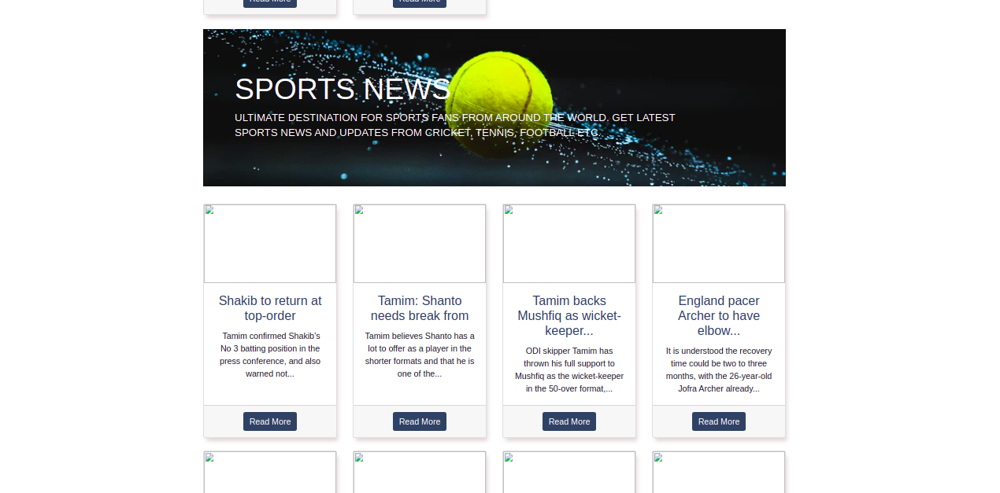
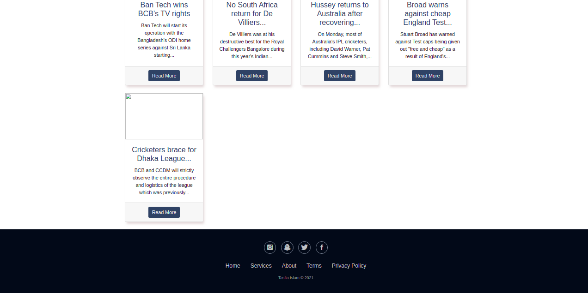

# News Scraper Project

Scraping news from websites using Beautiful Soup, Request, News API, Django `3.1.2`.

## Getting Started

Setup project environment with [virtualenv](https://virtualenv.pypa.io) and [pip](https://pip.pypa.io) with git bash

```bash
$ virtualenv env
$ source env/Scripts/activate
$ pip install -r requirements.txt 

# Run

$ cd news_scraper
$ python manage.py runserver

#Then visit http://localhost:8000 to view the app.
```

## Features

* Collect International news using NewsApiClient 
* Collect Local Sports news using BeautifulSoup, Requests

## How it looks like
* 1

* 2

* 3



## Contributing

Please feel free to fix bugs, improve things, provide documentation. Just send a pull request.